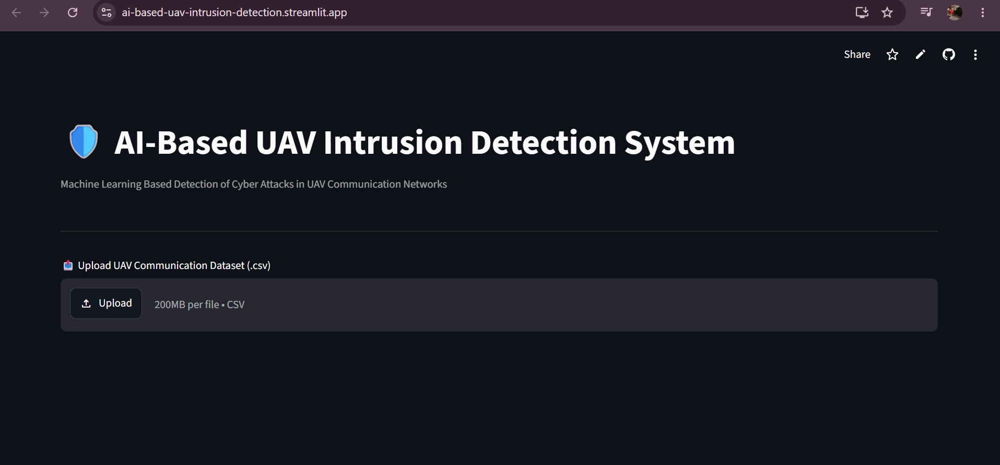
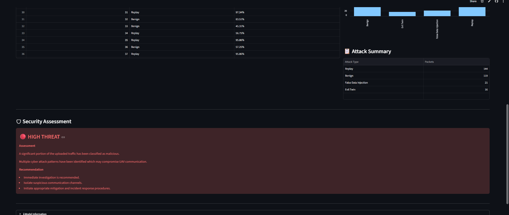
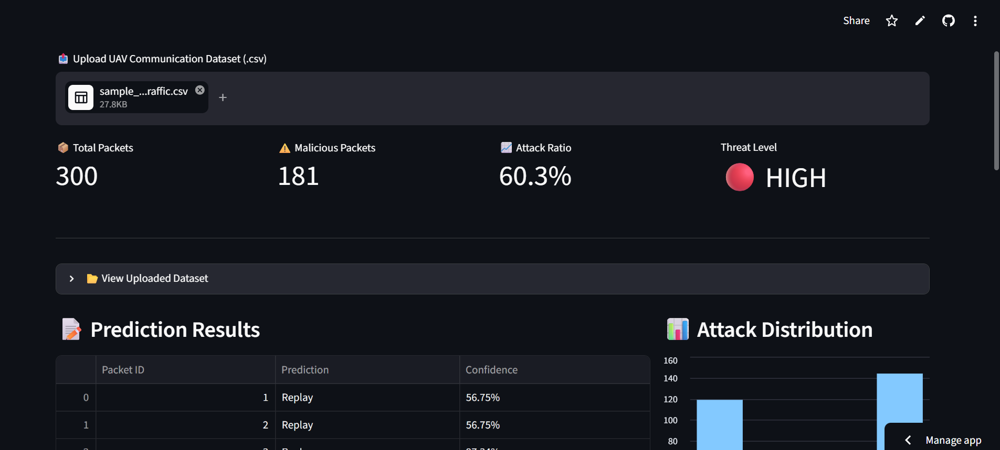

# AI-Based Intrusion Detection for UAV Communication Networks Using Machine Learning and Deep Learning


An AI-powered Intrusion Detection System (IDS) developed during my **Machine Learning Internship at DRDO**, designed to detect malicious communication patterns in UAV networks using Machine Learning techniques and a real-world cybersecurity dataset.

## Live Demo

**Streamlit Application:** https://ai-based-uav-intrusion-detection.streamlit.app/

---

## Project Overview

Modern **Unmanned Aerial Vehicles (UAVs)** play a critical role in defense applications such as border surveillance, reconnaissance, intelligence gathering, and real-time monitoring. Since UAVs continuously communicate with Ground Control Stations (GCS) over wireless networks, they are vulnerable to cyber attacks that can compromise communication reliability and mission safety.

This project develops an **AI-based Intrusion Detection System (IDS)** capable of classifying UAV network traffic as either normal or malicious by learning patterns from real-world network communication data.

---

## Key Features

- UAV network traffic intrusion detection using Machine Learning.
- Detection of Benign, DoS, and Replay attacks.
- Comprehensive data preprocessing and feature engineering pipeline.
- Exploratory Data Analysis (EDA) of network traffic.
- Comparison of Machine Learning and Deep Learning models.
- Interactive Streamlit Cloud deployment.
- CSV upload interface for real-time prediction.

---

## Live Application

The deployed Streamlit application allows users to upload a UAV communication dataset and receive real-time attack predictions through an interactive dashboard.

### Dashboard Overview



### Prediction Results



### Security Assessment



---

## Dataset

**Cyber-Physical Dataset for UAVs Under Normal Operations and Cyberattacks (IEEE T-ITS Dataset)**

The dataset contains network traffic collected from a real UAV cyber-physical testbed under both normal flight conditions and multiple cyber attack scenarios.

This project primarily utilizes the **Cyber (Network Communication)** portion of the dataset.

### Attack Categories

Original dataset:

- Benign Communication
- Deauthentication DoS Attack
- Replay Attack
- Evil Twin Attack
- False Data Injection (FDI)

Current implementation:

- Benign Traffic
- DoS Attack
- Replay Attack

The framework is designed to support additional attack categories as future extensions.

---

## Project Objectives

- Analyze the UAV cyber-physical dataset.
- Create a clean network intrusion dataset.
- Perform Exploratory Data Analysis.
- Develop Machine Learning baseline models.
- Compare Deep Learning and Machine Learning approaches.
- Build a deployable intrusion detection application.
- Demonstrate practical defense cybersecurity applications.

---

## Project Workflow

```text
Raw UAV Cyber-Physical Dataset
            │
            ▼
Dataset Understanding
            │
            ▼
Network Dataset Creation
            │
            ▼
Exploratory Data Analysis
            │
            ▼
Data Preprocessing
            │
            ▼
Feature Engineering
            │
            ▼
Machine Learning Models
(Logistic Regression, Random Forest, XGBoost)
            │
            ▼
Deep Learning Models
(MLP, LSTM)
            │
            ▼
Model Evaluation & Comparison
            │
            ▼
Streamlit Cloud Deployment
            │
            ▼
AI-Based UAV Intrusion Detection System